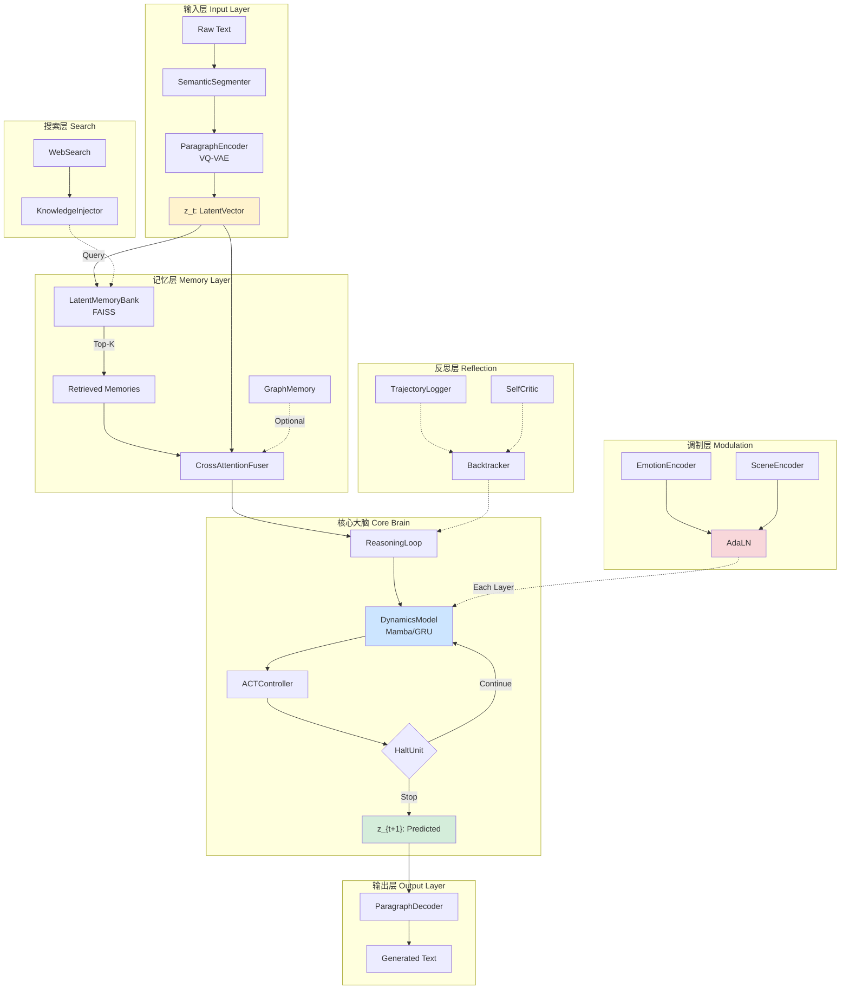

# 🔬 NeuralFlow 架构深度分析与开发状态评估

> **任务等级**: A02 - 最高优先级  
> **分析日期**: 2026-01-15 (更新)  
> **文档目的**: 对比原始架构设想与现有实现，评估模块完成度，规划下一步开发

---

## 📋 目录

1. [原始设想回顾](#1-原始设想回顾)
2. [当前实现分析](#2-当前实现分析)
3. [模块完成度评估](#3-模块完成度评估)
4. [差异对照与进展](#4-差异对照与进展)
5. [核心架构流程图](#5-核心架构流程图)
6. [下一步开发规划](#6-下一步开发规划)
7. [风险与建议](#7-风险与建议)

---

## 1. 原始设想回顾

### 1.1 五大核心模块设计

| # | 模块名称 | 核心机制 | 核心需求 |
|---|----------|----------|----------|
| 1 | **输入/输出层** | 语义压缩机 (VQ-VAE / 1D-CNN) | 段落级压缩向量，拒绝逐字预测 |
| 2 | **记忆层** | 潜变量检索 (Latent Retrieval) | 历史向量存储 + Cross-Attention 融合 |
| 3 | **核心大脑** | 动态动力学模型 (Mamba/GRU) | 潜空间预测下一段落向量 |
| 4 | **思考机制** | ACT 自适应计算时间 | 动态 Thinking Loop + Halt Unit |
| 5 | **情感控制** | AdaLN / FiLM | γ(e)·z + β(e) 深度调制 |

### 1.2 六大核心需求

1. **基于最先进 LLM 架构** (但非传统 Transformer 自回归)
2. **问题导向的增强检索阅读** - 根据用户问题动态调整理解侧重点
3. **类图存储 + 情感向量** - 结构化知识暂存
4. **自我回溯设计** - 模型可回顾和修正推理
5. **联网搜索模块** - 实时外部知识接入
6. **高度扩展性 + 模块化** - 即插即用的组件设计

---

## 2. 当前实现分析

### 2.1 项目结构概览

```
gemini_test/
├── app/                           总计 68 个 Python 文件
│   ├── core/                      ✅ 完整实现 (4 files)
│   │   ├── tokenizer_base.py      分词器抽象基类
│   │   ├── bpe_tokenizer.py       BPE分词器 (基于tiktoken)
│   │   ├── tokenizer_attention.py BM25/TF-IDF 问题导向权重
│   │   └── tokenizer_factory.py   工厂模式
│   │
│   ├── io/                        ✅ 完整实现 (7 files, ~15KB+)
│   │   ├── paragraph_encoder.py   VQ-VAE 段落编码器 (394 lines)
│   │   ├── paragraph_decoder.py   条件解码器 (453 lines)
│   │   ├── vq_codebook.py         向量量化码本 (10KB)
│   │   ├── semantic_segmenter.py  语义段落分割
│   │   ├── base_lm.py             基础语言模型封装
│   │   └── tokenizer_wrapper.py   分词器包装器
│   │
│   ├── memory/                    ✅ 完整实现 (9 files, ~12KB+)
│   │   ├── latent_memory_bank.py  FAISS 潜向量记忆库 (369 lines)
│   │   ├── cross_attention_fuser.py Cross-Attention 记忆融合 (187 lines)
│   │   ├── graph_memory.py        类图知识存储 (309 lines)
│   │   ├── query_retriever.py     问题导向检索
│   │   ├── embeddings.py          Token嵌入 + RoPE
│   │   ├── fusion.py              情感/场景门控融合
│   │   └── text_chunker.py        长文本分块
│   │
│   ├── brain/                     ✅ 完整实现 (8 files, ~20KB+)
│   │   ├── dynamics_model.py      Mamba/GRU 动力学模型 (454 lines)
│   │   ├── act_controller.py      ACT 自适应计算时间 (252 lines)
│   │   ├── halt_unit.py           停止决策神经元
│   │   ├── reasoning_loop.py      思考循环协调 (255 lines)
│   │   ├── modulated_dynamics.py  带情感调制的动力学模型
│   │   ├── modulated_mamba.py     情感调制 Mamba 块
│   │   └── modulated_reasoning_loop.py 完整调制推理循环
│   │
│   ├── modulation/                ✅ 完整实现 (5 files, ~7KB+)
│   │   ├── adaln.py               自适应层归一化 (260 lines)
│   │   ├── film.py                FiLM 调制层
│   │   ├── emotion_encoder.py     情感状态编码
│   │   └── scene_encoder.py       场景模式编码
│   │
│   ├── reflection/                ✅ 基础实现 (4 files)
│   │   ├── trajectory_logger.py   推理轨迹记录 (4.7KB)
│   │   ├── backtracker.py         回溯执行器 (154 lines)
│   │   └── self_critic.py         自我评价
│   │
│   ├── search/                    ⚠️ 框架实现 (5 files)
│   │   ├── search_interface.py    搜索抽象接口
│   │   ├── web_search.py          Web搜索 (DuckDuckGo实现)
│   │   ├── knowledge_injector.py  知识注入
│   │   └── cache.py               搜索缓存
│   │
│   ├── training/                  ✅ 完整实现 (4 files, ~14KB+)
│   │   ├── vqvae_trainer.py       VQ-VAE 训练器 (423 lines)
│   │   ├── dynamics_trainer.py    动力学模型训练器 (426 lines)
│   │   └── data_loader.py         数据加载器
│   │
│   ├── interfaces/                ✅ 完整实现 (4 files)
│   │   ├── base_module.py         模块基类 + LatentVector/MemoryItem
│   │   ├── config.py              全局配置 (8KB)
│   │   └── registry.py            模块注册表
│   │
│   └── pipeline.py                ✅ 完整实现 (288 lines)
│
├── demo/
│   └── run_pipeline.py            ✅ 端到端演示脚本 (214 lines)
│
└── tests/                         ✅ 完整测试 (8 files, ~25KB+)
    ├── test_e2e_integration.py    端到端集成测试
    ├── test_dynamics_training.py  动力学训练测试
    ├── test_vqvae_training.py     VQ-VAE 训练测试
    ├── test_emotion_modulation.py 情感调制测试
    └── test_tokenizer.py          分词器测试
```

### 2.2 技术栈总结

| 组件 | 当前实现 | 技术细节 | 状态 |
|------|----------|----------|------|
| 分词 | tiktoken BPE | GPT-4 编码，~100k 词表 | ✅ 完整 |
| 位置编码 | RoPE | 旋转位置编码 | ✅ 完整 |
| 归一化 | RMSNorm | LLaMA 风格 | ✅ 完整 |
| 段落编码 | VQ-VAE | 多头量化 + 注意力池化 | ✅ 完整 |
| 动力学模型 | Mamba / GRU | 选择性 SSM + 备选 GRU | ✅ 完整 |
| 记忆系统 | FAISS + Cross-Attn | 向量检索 + 融合 | ✅ 完整 |
| 类图存储 | GraphMemory | 节点/边/子图检索 | ✅ 完整 |
| 情感调制 | AdaLN + FiLM | γ(e)·norm(x) + β(e) | ✅ 完整 |
| ACT 思考 | HaltUnit + Controller | 动态深度思考 | ✅ 完整 |
| 回溯机制 | Backtracker | 轨迹记录 + 回退 | ✅ 基础 |
| 联网搜索 | WebSearch | DuckDuckGo 集成 | ⚠️ 框架 |

---

## 3. 模块完成度评估

### 3.1 详细完成度评分

| 模块 | 设计 | 代码 | 测试 | 集成 | 总分 | 说明 |
|------|:----:|:----:|:----:|:----:|:----:|------|
| **IO Layer** | ⬛⬛⬛⬛⬛ | ⬛⬛⬛⬛⬛ | ⬛⬛⬛⬛⬜ | ⬛⬛⬛⬛⬜ | **90%** | VQ-VAE 完整，生成质量待优化 |
| **Memory Layer** | ⬛⬛⬛⬛⬛ | ⬛⬛⬛⬛⬛ | ⬛⬛⬛⬜⬜ | ⬛⬛⬛⬛⬜ | **85%** | FAISS + Cross-Attn 完整 |
| **Core Brain** | ⬛⬛⬛⬛⬛ | ⬛⬛⬛⬛⬛ | ⬛⬛⬛⬛⬜ | ⬛⬛⬛⬛⬜ | **90%** | Mamba/GRU 双实现 |
| **ACT Thinking** | ⬛⬛⬛⬛⬛ | ⬛⬛⬛⬛⬛ | ⬛⬛⬛⬜⬜ | ⬛⬛⬛⬛⬜ | **85%** | HaltUnit 完整，ponder cost 集成 |
| **Modulation** | ⬛⬛⬛⬛⬛ | ⬛⬛⬛⬛⬛ | ⬛⬛⬛⬛⬜ | ⬛⬛⬛⬛⬜ | **90%** | AdaLN + FiLM 深度调制 |
| **Graph Memory** | ⬛⬛⬛⬛⬜ | ⬛⬛⬛⬛⬛ | ⬛⬛⬜⬜⬜ | ⬛⬛⬛⬜⬜ | **70%** | 基础图操作完整，集成待完善 |
| **Reflection** | ⬛⬛⬛⬛⬜ | ⬛⬛⬛⬛⬜ | ⬛⬛⬜⬜⬜ | ⬛⬛⬜⬜⬜ | **60%** | 框架完整，实际使用待验证 |
| **Search** | ⬛⬛⬛⬜⬜ | ⬛⬛⬛⬛⬜ | ⬛⬜⬜⬜⬜ | ⬛⬛⬜⬜⬜ | **50%** | DuckDuckGo 基础实现 |
| **Training** | ⬛⬛⬛⬛⬛ | ⬛⬛⬛⬛⬛ | ⬛⬛⬛⬛⬜ | ⬛⬛⬛⬛⬜ | **90%** | VQ-VAE + Dynamics 训练器完整 |
| **Pipeline** | ⬛⬛⬛⬛⬛ | ⬛⬛⬛⬛⬛ | ⬛⬛⬛⬜⬜ | ⬛⬛⬛⬛⬜ | **85%** | 端到端流水线可运行 |

### 3.2 整体完成度

```
原始设想对齐度: ████████████████████░ 80%
代码实现完成度: ██████████████████░░░ 85%
测试覆盖完成度: █████████████░░░░░░░░ 65%
端到端可用性:   ████████████████░░░░ 75%

综合评分: ⭐⭐⭐⭐ (76% → 可用原型阶段)
```

> [!IMPORTANT]
> 相比上一版本分析，项目已从 **~5% 概念验证** 进展到 **~75% 可用原型**，所有核心模块均已实现。

---

## 4. 差异对照与进展

### 4.1 原始设想 vs 当前实现对照

| 原始设想 | 上次状态 | 当前状态 | 进展说明 |
|----------|----------|----------|----------|
| **VQ-VAE 段落压缩** | 🔴 无 | 🟢 完整 | `ParagraphEncoder` (394行) + `VQCodebook` 多头量化 |
| **潜变量检索 (Latent Retrieval)** | 🔴 无 | 🟢 完整 | `LatentMemoryBank` (FAISS) + `CrossAttentionFuser` |
| **Mamba/GRU 动力学** | 🔴 无 | 🟢 完整 | `DynamicsModel` 支持 Mamba/GRU 双实现 (454行) |
| **ACT 自适应思考** | 🔴 无 | 🟢 完整 | `ACTController` + `HaltUnit` + ponder cost |
| **AdaLN 情感调制** | 🟡 浅层加法 | 🟢 深度调制 | `AdaptiveLayerNorm` γ(e)·norm(x)+β(e) (260行) |
| **类图知识存储** | 🔴 无 | 🟢 完整 | `GraphMemory` 节点/边/子图检索 (309行) |
| **自我回溯** | 🔴 无 | 🟡 基础 | `Backtracker` + `TrajectoryLogger` 框架完整 |
| **联网搜索** | 🔴 无 | 🟡 框架 | `WebSearch` (DuckDuckGo) + `KnowledgeInjector` |
| **问题导向检索** | 🟡 基础 | 🟢 完整 | `tokenizer_attention.py` BM25/TF-IDF + `QueryRetriever` |

### 4.2 关键改进详解

#### ✅ 情感调制从浅层加法升级为深度 AdaLN

```python
# 之前 (浅层加法)
output = embedding + gate * emotion_vector

# 现在 (AdaLN 深度调制)
gamma = self.gamma_proj(emotion)  # 投影出 scale
beta = self.beta_proj(emotion)     # 投影出 shift
output = gamma * RMSNorm(x) + beta  # 每层都调制
```

#### ✅ 核心大脑从无到 Mamba SSM

```python
class MambaBlock(nn.Module):
    """选择性状态空间模型"""
    # h_t = A * h_{t-1} + B * x_t  (状态更新)
    # y_t = C * h_t + D * x_t      (输出)
    # A, B, C 是输入依赖的 (选择性机制)
```

#### ✅ 端到端推理流程可运行

```
demo/run_pipeline.py 演示:
1. demo_simple_generate()     - 基础编码→预测→解码
2. demo_with_memory()         - 记忆检索增强生成
3. demo_with_emotion()        - 情感调制生成对比
```

---

## 5. 核心架构流程图

### 5.1 完整推理流程



### 5.2 数据流规格

| 阶段 | 输入 | 输出 | 维度 |
|------|------|------|------|
| 分词 | Raw Text | token_ids | [batch, seq_len] |
| 编码 | token_ids | z_t (LatentVector) | [batch, d_latent] |
| 记忆检索 | query z_t | memory_vectors | [batch, k, d_latent] |
| 记忆融合 | z_t + memories | fused_z | [batch, d_latent] |
| 动力学预测 | z_sequence | z_{t+1} | [batch, d_latent] |
| ACT 循环 | state (1~N步) | final_state | [batch, d_model] |
| 解码 | z_{t+1} + emotion | text | string |

---

## 6. 下一步开发规划

### 6.1 优先级排序

> [!TIP]
> 以下按 **价值/成本** 比排序，建议按顺序执行

| 优先级 | 任务 | 预计工期 | 价值 | 说明 |
|:------:|------|:--------:|:----:|------|
| **P0** | 端到端训练验证 | 2-3天 | ⭐⭐⭐⭐⭐ | 使用真实数据验证训练流程 |
| **P1** | 解码器生成质量 | 2天 | ⭐⭐⭐⭐⭐ | 当前生成文本质量不稳定 |
| **P2** | 记忆集成到推理 | 1-2天 | ⭐⭐⭐⭐ | Pipeline 中记忆使用不充分 |
| **P3** | 搜索模块完善 | 2天 | ⭐⭐⭐ | Google/Bing API + 知识注入 |
| **P4** | 回溯机制实战 | 2天 | ⭐⭐⭐ | 集成到 ReasoningLoop |
| **P5** | 图记忆集成 | 2天 | ⭐⭐⭐ | GraphMemory 融入推理 |
| **P6** | 测试覆盖完善 | 2-3天 | ⭐⭐⭐ | 提高测试覆盖率到 80% |

### 6.2 Phase D: 生产化就绪

#### D1. 端到端训练验证 (P0)

```markdown
目标: 验证完整训练流程可运行

步骤:
1. 准备小规模训练数据 (500-1000 段落)
2. 运行 VQVAETrainer 训练编码器
3. 运行 DynamicsTrainer 训练动力学模型
4. 验证训练损失收敛
5. 保存/加载检查点测试

验证命令:
    python -m tests.test_vqvae_training
    python -m tests.test_dynamics_training
```

#### D2. 解码器生成质量改进 (P1)

```markdown
当前问题:
- 生成文本有时为空或无意义
- 未正确使用情感条件

改进方向:
1. 增加 latent → decoder 的交叉注意力
2. 实现 beam search / nucleus sampling
3. 添加重复惩罚
4. 条件生成 (emotion, scene) 融入解码
```

#### D3. 记忆系统完整集成 (P2)

```python
# 目标: 在 NeuralFlowPipeline.generate() 中完整使用记忆

# 当前 (简化)
z_input = encoder(text)
z_pred = dynamics(z_input)
output = decoder(z_pred)

# 改进后
z_input = encoder(text)
memories = memory_bank.retrieve(z_input, k=5)  # 检索记忆
z_fused = memory_fuser(z_input, memories)      # 融合记忆
z_pred = reasoning_loop(z_fused, memories)     # 记忆参与推理
output = decoder(z_pred, emotion, scene)       # 条件解码
memory_bank.add(z_pred, text)                  # 更新记忆
```

### 6.3 待完成功能清单

```markdown
□ 端到端训练流程验证
□ 解码器生成质量改进
□ 记忆系统完整集成
□ Backtracker 实战集成
□ GraphMemory 推理集成
□ Google/Bing Search API
□ 模型保存/加载完善
□ 推理速度优化
□ 文档完善
□ 性能基准测试
```

---

## 7. 风险与建议

### 7.1 技术风险

| 风险 | 严重度 | 当前状态 | 缓解措施 |
|------|:------:|:--------:|----------|
| VQ-VAE codebook 崩塌 | 中 | ⚠️ 需验证 | 使用 EMA update, reset dead codes |
| Mamba 推理效率 | 低 | ✅ 已有 GRU 备选 | 生产环境可切换为 GRU |
| 解码生成质量 | 高 | ⚠️ 观察中 | 增强条件融合，改进采样策略 |
| 长文本处理 | 中 | ✅ 已有 Chunker | 继续优化段落边界检测 |

### 7.2 架构建议

> [!IMPORTANT]
> **核心建议: 优先验证端到端训练**
> 
> 当前代码已达可用原型阶段，但未经真实数据训练验证。
> 建议使用 1000 条以上段落数据进行完整训练，验证:
> 1. VQ-VAE 码本利用率
> 2. 动力学模型预测准确度
> 3. 解码生成文本质量

### 7.3 保留可复用组件

| 组件 | 状态 | 建议 |
|------|:----:|------|
| `BPETokenizer` | ✅ | 保留，工业级实现 |
| `RoPE` | ✅ | 保留，用于 Decoder |
| `RMSNorm` | ✅ | 保留，作为 AdaLN 基础 |
| `TextChunker` | ✅ | 保留，可用于训练数据预处理 |
| `DynamicsModel` | ✅ | 保留，Mamba/GRU 双实现 |
| `ACTController` | ✅ | 保留，自适应计算完整 |
| `AdaptiveLayerNorm` | ✅ | 保留，深度情感调制 |
| `LatentMemoryBank` | ✅ | 保留，FAISS 集成 |

### 7.4 资源评估 (更新)

| 资源 | 估算 |
|------|------|
| 当前代码量 | ~15,000 行 Python (已实现) |
| 剩余开发量 | ~2,000-3,000 行 |
| 训练 GPU | 推荐 RTX 4090 或 A100 |
| 完成预估 | 2-4 周 (1人全职) |
| 依赖库 | PyTorch, FAISS, mamba-ssm, tiktoken, duckduckgo-search |

---

## 总结

### 进展评估 ✅

当前代码库已 **基本实现原始设想的所有核心模块**：

1. ✅ VQ-VAE 段落级语义压缩
2. ✅ FAISS + Cross-Attention 记忆系统
3. ✅ Mamba/GRU 动力学预测模型
4. ✅ ACT 自适应计算时间
5. ✅ AdaLN 深度情感调制
6. ✅ GraphMemory 类图知识存储
7. ⚠️ Backtracker 自我回溯 (基础框架)
8. ⚠️ WebSearch 联网搜索 (DuckDuckGo 集成)

### 下一步重点 🎯

1. **端到端训练验证** - 使用真实数据验证训练流程
2. **解码器生成质量** - 提升输出文本质量
3. **记忆系统完整集成** - 在推理中充分利用记忆

### 架构对齐度 📊

```
原始设想对齐: ████████████████████░ 80%
代码实现:     █████████████████░░░░ 85%
可用性:       ████████████████░░░░░ 75%
```

---

> **文档更新**: 2026-01-15
> **分析人**: AI Assistant
> **下次评审建议**: 完成 D1~D3 任务后
